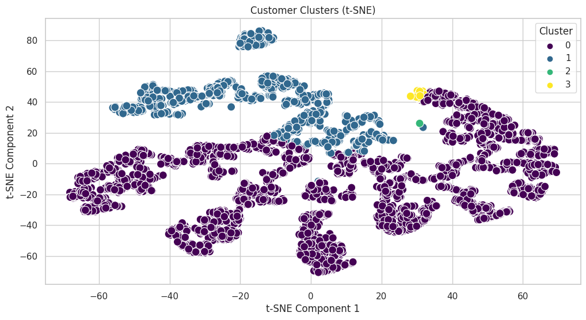

# Customer Segmentation and Sales Analytics for Retail Optimization

## Project Overview
This project applies **RFM (Recency, Frequency, Monetary) analysis** and **K‑Means clustering** to segment customers of an online retail store. The goal is to identify high‑value customer groups, analyse sales trends and geographic patterns, and provide actionable recommendations for marketing and inventory strategies.

## Live Resources
- **📓 Kaggle Notebook**: [Customer Segmentation and Sales Analytics](https://www.kaggle.com/code/miracleajoku/customer-segmentation-and-sales-analytics/notebook)
- **📊 Dataset**: [Online Retail (UCI)](https://archive.ics.uci.edu/dataset/352/online+retail)

## Tools & Libraries
- Python (pandas, numpy, matplotlib, seaborn, scikit‑learn)
- RFM metric calculation
- K‑Means clustering (elbow method, silhouette score)
- Data visualisation

## Methodology
1. **Data cleaning** – removed cancelled orders, returns, missing customer IDs.
2. **RFM calculation** – for each customer: Recency (days since last purchase), Frequency (number of transactions), Monetary (total spend).
3. **Additional feature** – Average Order Value (Monetary / Frequency).
4. **Clustering** – K‑Means with scaled RFM + Avg_Order_Value.
5. **Cluster interpretation** – analysed cluster characteristics and labelled segments.

## Cluster Profiles (Key Findings)

The table below summarises the four customer segments:

| Cluster | Recency | Frequency | Monetary ($) | Avg Order Value ($) | Size | Segment Label |
|---------|---------|-----------|--------------|---------------------|------|----------------|
| 0 | 41.23 days | 4.69 | 1,901.20 | 390.22 | 3,225 | Moderate‑Value |
| 1 | 163.50 days | 1.50 | 122,828.05 | 80,709.93 | 2 | Ultra‑High‑Value |
| 2 | 246.30 days | 1.58 | 522.61 | 325.89 | 1,088 | Low‑Value, Inactive |
| 3 | 6.30 days | 73.13 | 84,416.87 | 1,621.23 | 23 | High‑Frequency, High‑Value |

### Segment Insights & Recommendations

- **Cluster 3 (High‑Frequency, High‑Value)** – Very recent, highly frequent, high spend.  
  *Action*: Retention programs, loyalty rewards, exclusive perks.

- **Cluster 1 (Ultra‑High‑Value, Low Frequency)** – Extremely high spend but rare purchases (2 customers).  
  *Action*: Personalised service, exclusive offers; investigate why frequency is low.

- **Cluster 0 (Moderate‑Value)** – Largest segment (3,225 customers), moderately engaged.  
  *Action*: Upselling/cross‑selling campaigns, loyalty programs to increase frequency.

- **Cluster 2 (Low‑Value, Inactive)** – Long recency, low spend.  
  *Action*: Win‑back campaigns (discounts, personalised offers); deprioritise if no response.

## Business Impact
- **Priority segments**: Cluster 3 and Cluster 1 drive most revenue; focus retention and personalisation.
- **Growth opportunity**: Cluster 0 can be moved to higher value with targeted campaigns.
- **Cost saving**: Cluster 2 can be de‑prioritised after re‑engagement attempts.

## How to Reproduce
1. Clone this repository.
2. Visit the [Kaggle notebook](https://www.kaggle.com/code/miracleajoku/customer-segmentation-and-sales-analytics/notebook).
3. Download the Online Retail dataset from UCI.
4. Run the notebook step by step – all code is included.

## Author
**Miracle Ajoku**  
[GitHub](https://github.com/neutron-96) | [LinkedIn](https://www.linkedin.com/in/miracle-ajoku-38339523a/)

## Acknowledgements
- Dataset: UCI Machine Learning Repository (Online Retail)
- Inspiration: RFM analysis and customer segmentation best practices.